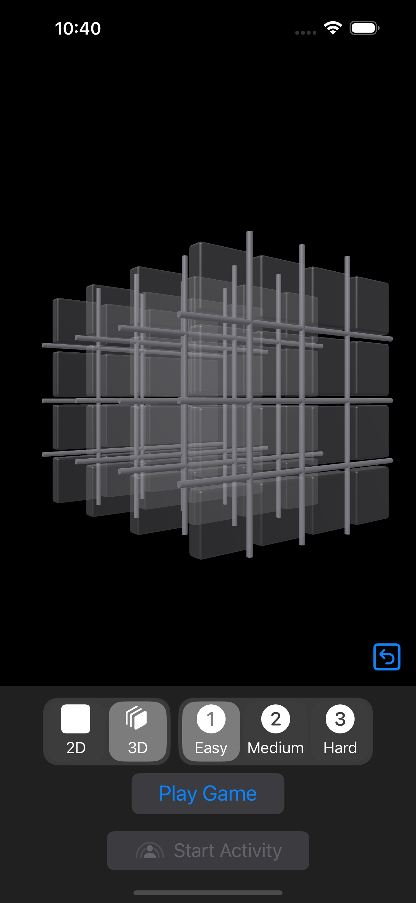
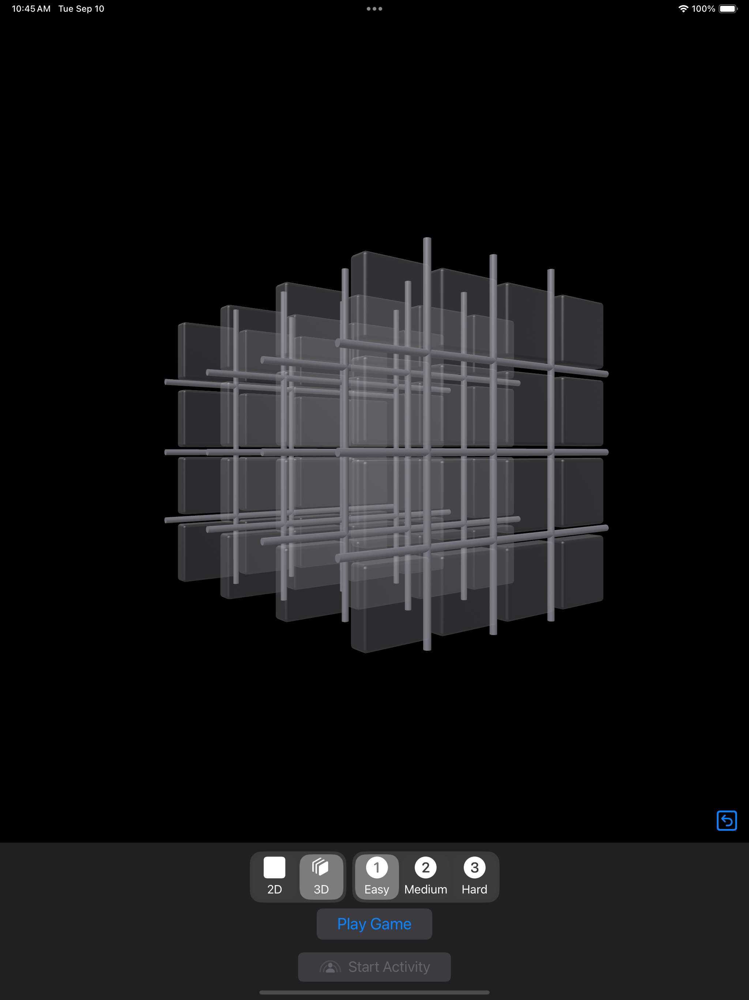
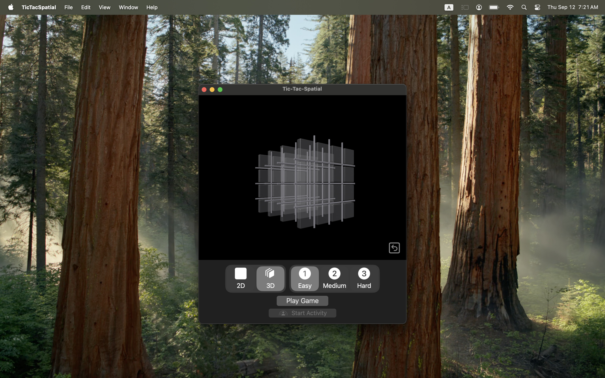
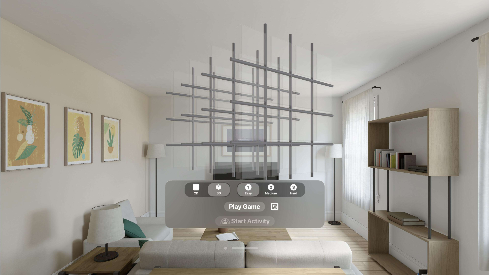

## Summary
Provide an example of an Apple cross-platform, best-practice RealityKit app by using Tic-Tac-Toe gameplay. There are 2 gameboards, a 2-dimensional 3x3 and a 3 dimensional 4x4x4. The game modes supported are against a bot (easy, mediaum or hard levels) and a remote opponent using SharePlay.

This runs on iOS, iPadOS, macOS (not Catalyst) and visionsOS. 

Code resuse is done across 2 dimensions; platform and gameboard size. The bot logic and the game engine itself is the same regardless of gameboard size. This app takes an MVVM approach. Most of the views can be resused across platform as is or with minor changes. The view models do not have any platform specific changes.

## Best Practices
- 100% Swift 6
- Combine
- Structured Concurrency
- SwiftUI
- RealityKit
- SharePlay
- Swift Testing Unit Tests
- Localization with RTL support using .xcstrings (in Arabic)
- Cross Platform Code Reuse (90%+)
- iOS/macOS dark mode & light mode support

## App Code Design
### GameEngine (Gameboards types)
This has no UI depedencies and no understanding the type of player (human, bot, shareplay, etc). It is simply designed to determine game state after gameboard operations (move, undo, etc). Changes to the gameboard are published from the game engine through an asynchronous stream. 

### GameController (shared RealityKit UI, SharePlay, GameSession)
### UI (iOS/macOS/visionOS)

## Code Reuse Details
| Description        | % of Lines of Code |
| ---                | ---      |
| Shared 3 Platforms |    83.7% |
| Shared 2 Platforms |     6.5% |
| iOS only           |     0.2% |
| macOS only         |     0.3% |
| visionOS only      |     9.3% |

## To Do's
- Use CoreML for the bot AI
- More RealityKit UI polish
- Support a command line interface, which could run on macOS and Linux.

## Screenshots
### Landing Pages

## [More Screenshots](https://github.com/msanford1540/ttspatial/tree/develop/AppStore/english)

### Misc Videos
Spin 3D Gameboard on macOS video...

https://github.com/user-attachments/assets/08c1f18e-85ee-4bb4-b700-bb3fbea2977e

SharePlay on visionOS video...

https://github.com/user-attachments/assets/0ba91d37-1dad-4c47-9e64-abcabd7cb1e4
